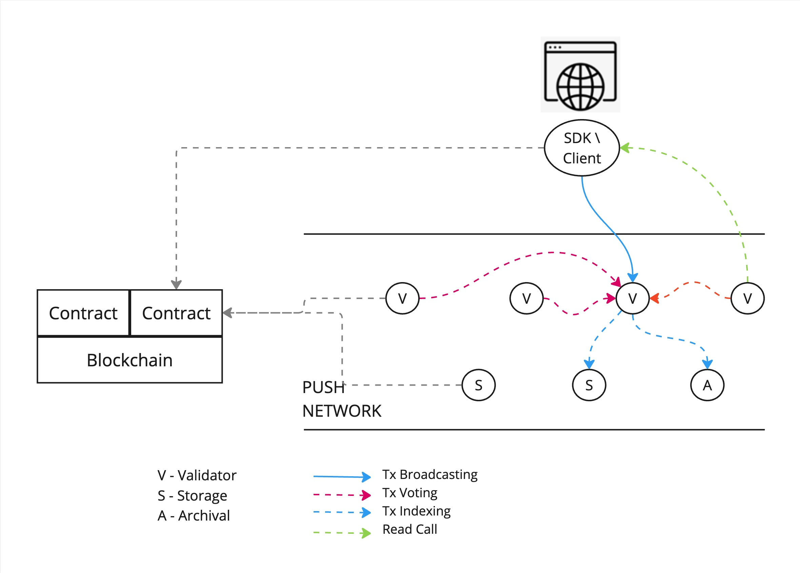

<h1 align="center">
    <a href="https://push.org/#gh-light-mode-only">
    
    </a>
    <a href="https://push.org/#gh-dark-mode-only">
    
    </a>
</h1>

<p align="center">
  <i align="center">Push Protocol is a web3 communication network, enabling cross-chain notifications, messaging and much more for dapps, wallets, and services.🚀</i>
</p>

<h4 align="center">

  <a href="https://discord.com/invite/pushprotocol">
    
  </a>
  <a href="https://twitter.com/pushprotocol">
    
  </a>
  <a href="https://www.youtube.com/@pushprotocol">
    
  </a>
</h4>

<p align="center">
    
</p>

# Push Storage Node

Push Storage Node is a part of Push's Proof of Stake (PoS) chain and is responsible for storing transactions along with the payload data in a sharded fashion.

## Table of Contents

- [Overview](#overview)
- [Architecture](#architecture)
- [Installation](#installation)
- [Contributing](#contributing)
- [License](#license)

## Overview

After transactions are validated by `Validator Nodes` of the PoS chain and a new block is produced, it is picked up by `Storage Nodes` for storage and indexing.
Push Storage Nodes ensure reliable and efficient storage of transaction data by distributing the data across multiple nodes (sharding). This allows for enhanced data redundancy, fault tolerance, scalability and also ensures running a storage node is cost-effective since only a fraction of the data is stored on each node.

## Architecture

### Interaction in Network

In the network, once blocks are processed by validator nodes, they are picked up by storage nodes for further handling. The following diagram illustrates the interaction between the network and the storage nodes:



### Sharding

Sharding is a key component of the Push Storage Node architecture. Each node is responsible for a specific list of shards, ensuring a distributed and balanced load across the network. This approach enhances fault tolerance and scalability.

- **Shard Responsibility:** Each node handles a set of shards defined by the `storage.sol` smart contract, storing the associated transaction data.
- **Replication Factor:** To ensure data redundancy and reliability, each shard is replicated across multiple nodes. This replication factor can be adjusted based on the network requirements and is managed by the `storage.sol` smart contract.
- **Resharding:** As more nodes join the network, resharding is performed to redistribute the shards and maintain balance. This ensures that the system can scale efficiently with the addition of new nodes.


### Indexation of Data

Indexing transaction data is crucial for quick retrieval and efficient querying. The table below represents a proposed structure for transaction indexation:

| wallet        | Tx Hash                              | Block Hash                           | Category | Tx Data                  | Timestamp |
| ------------- | ------------------------------------ | ------------------------------------ | -------- | ------------------------ | --------- |
| eip155:1:0xAA | b0249fbb-a03d-4292-9599-042c6993958e | 2608d687-fe55-4fe9-9fa5-1f782dcebb34 | email    | protobuf_serialized_data | epoch     |

> **Note:** The above table example is a simplified representation of the transaction indexation structure. The actual implementation may include additional fields based on the requirements of the network.

## Installation

### Prerequisites

- [Node.js](https://nodejs.org/) (>= 18)
- [Docker](https://www.docker.com/)
- [Yarn](https://yarnpkg.com/)

### Setup `do.sh` Script

The `do.sh` script is included inside the **`zips`** folder. It provides shortcuts for running various commands, including publishing a default test key and executing Hardhat with arguments. Ensure you review the code before executing any commands.

- **Setting up `do.sh`**

  - Place `do.sh` in a directory accessible by your environment (e.g., your home directory).
  - Grant execute privileges to the script:
    ```bash
    chmod +x do.sh
    ```

- **Running `do.sh`**
  There are multiple ways to execute the `do.sh` script:
  - **Full Path Execution:**
    Navigate to the project directory:
    ```bash
    cd /path/to/push-storage-node-project-dir /home/user/do.sh command1 command2 command3
    ```
  - **Add `do.sh` to Your Path:**
    Follow the instructions in [this Apple discussion](https://discussions.apple.com/thread/254226896?sortBy=best) to add `do.sh` to your system path. Then, navigate to the project directory:
    ```bash
    cd /path/to/push-storage-node-project-dir
    ./do.sh command1 command2 command3
    ```
  - **Create an Alias for `do.sh` (Recommended):**
    Add an alias to your shell configuration:
    ```bash
    # Open .zshrc file
    nano $HOME/.zshrc
    # Add this line to the file
    alias do='/Users/your-username/Documents/projects/do.sh'
    # Save and close the file
    ```
    Restart your shell to apply changes. Now, you can use `do` to run commands:
    ```bash
    cd /path/to/push-storage-node-project-dir
    do command1 command2 command3
    ```

### Running the Node

1.  Clone the repository:

    ```bash
    git clone https://github.com/push-protocol/push-snode.git
    cd push-snode
    ```

2.  Install dependencies:

    ```bash
    yarn install
    ```

3.  Configure docker directories:
    To set up the storage nodes, you'll need to configure specific directories for each node. This setup ensures that each node runs independently with its own environment and key files.

    - **Download and Unpack Docker Directory:**
      Get the `docker-dir-for-snodes.zip` file from the `zips` folder and extract it into your project's root directory. After extraction, you'll find a `/docker` directory containing subdirectories for each node: `/docker/01, /docker/02`.
      Each node directory (e.g., docker/01, docker/02) contains the necessary configuration files and scripts to run the node.

    - **Key Files within Each Node Directory:**
      This file contains environment-specific properties, such as database credentials, node identifiers, and other configuration settings that the node requires to operate.

4.  Start the docker container:

    ```bash
    docker-compose up
    ```

    > **Note:** It is expected that after this command you would have the following containers running: **mysql, postgres, redis**

5.  MySQL Database Setup:
    For the nodes to function correctly, you need to set up two separate MySQL databases, one for each node. These databases will store the data related to each storage node.

    - Access the MySQL command-line interface by running the following command in your terminal:

      ```bash
      mysql -u root -p PASSWORD=pass
      ```

    - Once you're in the MySQL CLI, create each of the databases by running the following commands:

      ```bash
      CREATE DATABASE snode1 CHARACTER SET utf8 COLLATE utf8_general_ci;
      CREATE DATABASE snode2 CHARACTER SET utf8 COLLATE utf8_general_ci;
      ```

6.  Postgres Database Setup:
    For the nodes to function correctly, you need to set up two separate Postgres databases, one for each node. These databases will store the data related to each storage node.

    - Access the pSql command-line interface by running the following command in your terminal:

      ```bash
      psql -U postgres -d postgres
      ```

    - Once you're in the pSql CLI, create each of the databases by running the following commands:

      ```bash
      create database snode1;
      create database snode2;
      ```

7.  Run the nodes in separate terminals:

    ```bash
    # Run Storage Node 1
    do debug.s1

    # Run Storage Node 2
    do debug.s2
    ```

## Contributing

We welcome contributions from the community! To contribute, please follow these steps:

1. Fork the repository.
2. Create a new branch (`git checkout -b feature/your-feature-name`).
3. Make your changes and commit them (`git commit -m 'Add some feature'`).
4. Push to the branch (`git push origin feature/your-feature-name`).
5. Open a pull request.

Please ensure your code adheres to our coding standards and includes appropriate tests.

## License

This project is licensed under the MIT License. See the [LICENSE](LICENSE) file for details.
